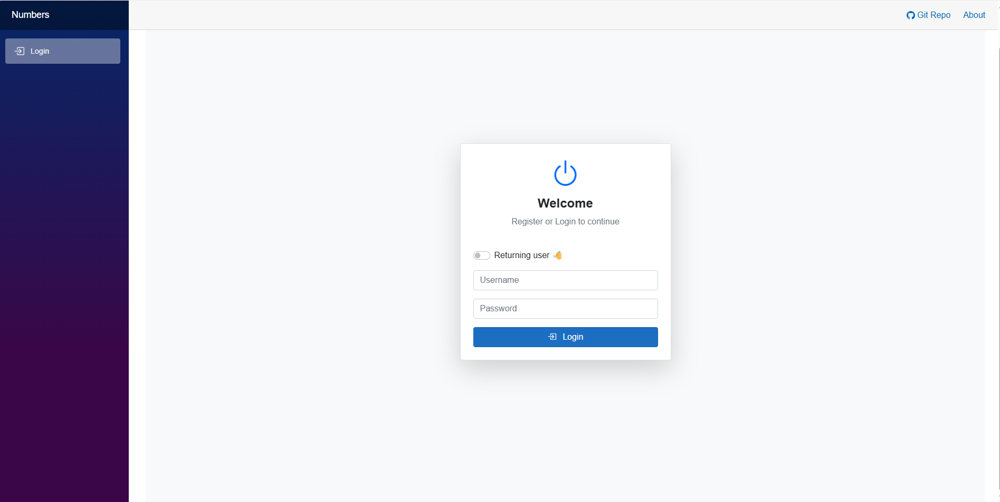
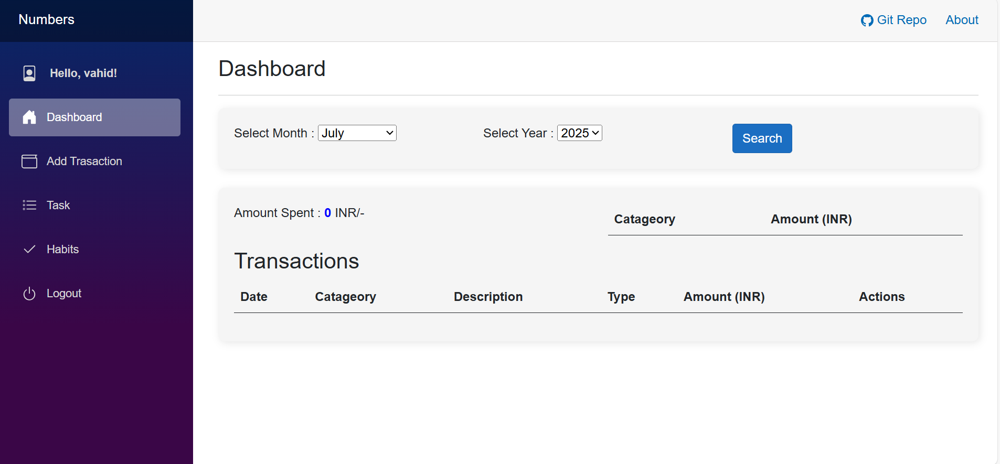
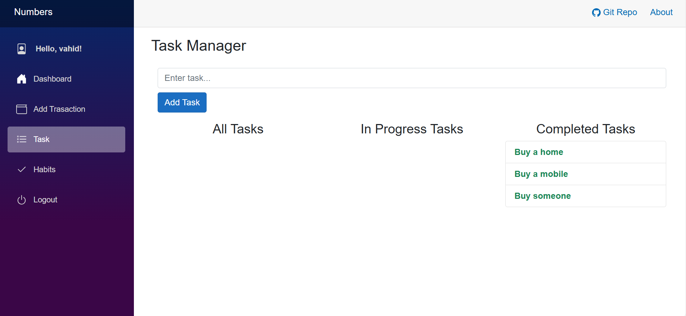

# AzureTestApp

**AzureTestApp** is a Blazor Server application powered by Web API — your future MVP for managing 💸 finances, 📝 notes, and ✅ to-do lists, all under one login.

---

## 🚀 Features

- JWT-based login/logout for secure sessions
- SessionStorage token persistence
- Clean, responsive UI using Bootstrap
- REST API integration with user-specific data
- Reusable components and modular Razor pages

---

## 📸 Screenshots

| Login | Dashboard | Notes | Habits |
|-------|-----------|-------|-------|
|  |  |  |  | 

---

## 🔧 Tech Stack

- **Blazor Server (.NET)**
- **C# & Razor Components**
- **Bootstrap 5**
- **HTML/CSS**
- **JavaScript Interop**

---

## ⚙️ Getting Started

```bash
git clone https://github.com/VahidSE/AzureTestApp.git
cd AzureTestApp
dotnet restore
dotnet run

## 🤝 Contributing

Pull requests welcome! Some ideas you could work on:
-   📊 Financial charting
-   🌙 Dark mode toggle
-   📱 Mobile ready application
